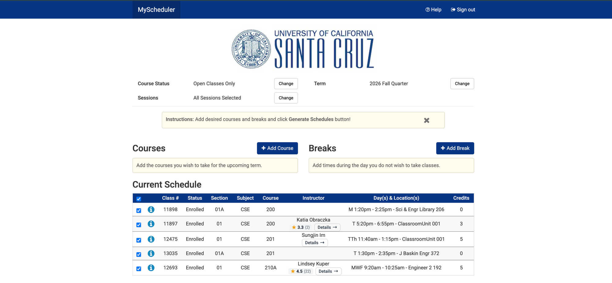
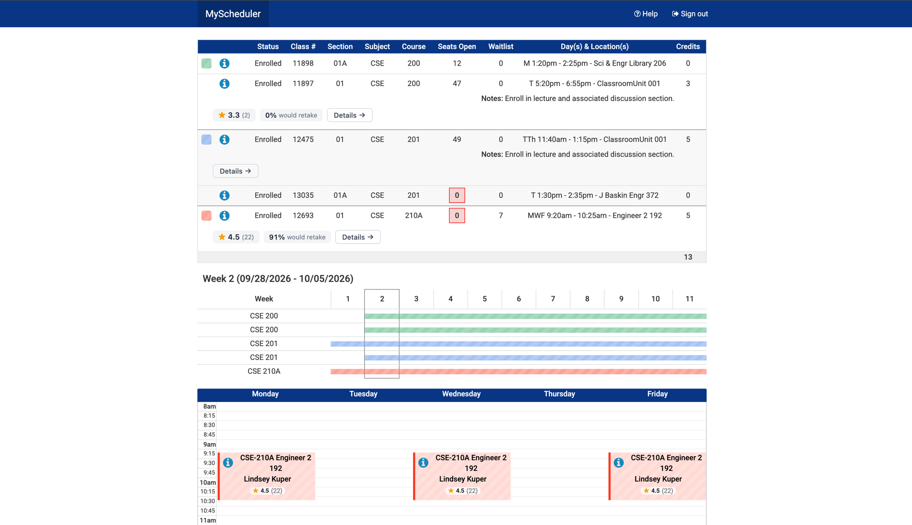

<div align="center">


# Rate My Slugs

Professor ratings, grade distributions, and detailed profiles, shown right where you browse UCSC courses on MyUCSC and MyScheduler.

[](https://chromewebstore.google.com/detail/rate-my-slugs/ddmahbdpmhbeohjjblfopgggdbfieboo)
[](LICENSE)
[](https://github.com/IvanKuria/rate-my-slugs/releases)
[](https://developer.chrome.com/docs/extensions/mv3/intro/)
[](https://wxt.dev)

</div>

## Overview

Rate My Slugs is a Chrome extension for UCSC students. It pulls Rate My Professors ratings, campus directory details, and historical grade distributions directly into the MyUCSC enrollment experience — and into MyScheduler, where you actually pick your sections — so you can size up a class without leaving the page or juggling browser tabs.

## Screenshots

Inline ratings on the search results page. Every class shows the professor's rating, review count, and would-retake percentage at a glance.


Click "Details" on any class to open a side panel with the full professor profile: contact info, department, Rate My Professors scores, top tags, reviews, and grade distribution.


Ratings in MyScheduler, right beside the instructor in your Current Schedule and in the section picker — the screen where you choose between lecture sections.



On a generated schedule, each section gets the full rating bar, and every calendar block carries the professor's score. The schedule summary table lists no instructor at all, so those names are resolved from MyScheduler's own section data.



## Features

- **Inline ratings.** See professor ratings on search results, shopping cart, and enrolled classes pages without any extra clicks.
- **MyScheduler support.** Ratings appear in the Current Schedule table, the section picker, generated schedules, and calendar blocks.
- **Grade distributions.** View historical grade breakdowns for a given professor and course combination.
- **Professor profiles.** Open a side panel with full details: contact info, department, research interests, Rate My Professors reviews, and more.
- **Accurate matching.** MyUCSC abbreviates instructors to "Lee,D.", which two different professors can share. Ratings are matched using the course subject to tell them apart, and on MyScheduler the instructor's CruzID is read directly from the page's own data, so no guessing is involved.
- **Fast.** Lazy-loaded modules, concurrent data preloading, and one-week caching keep repeat visits instant.
- **Privacy first.** All data is stored locally. No analytics, no tracking, no data collection.

## Install

**Chrome Web Store:** [Rate My Slugs](https://chromewebstore.google.com/detail/rate-my-slugs/ddmahbdpmhbeohjjblfopgggdbfieboo)

**Manual install:**

1. Download the [latest release](https://github.com/IvanKuria/rate-my-slugs/releases).
2. Unzip the file.
3. Open `chrome://extensions/` and enable **Developer mode**.
4. Click **Load unpacked** and select the unzipped folder.

## How It Works

Navigate to any MyUCSC enrollment page. The extension automatically detects professor names and renders an inline rating bar:

```
Sammy 4.4 (33)    85% would retake    Details ->
```

The same bar appears in MyScheduler, sized to fit each surface: a compact badge beside the instructor's name in a table, the full bar beneath a section on a generated schedule, and a bare score inside a calendar block.

Click **Details** to open the side panel with the full professor profile, including Rate My Professors reviews, campus directory info, and grade distributions.

## Tech Stack

| Layer | Technology |
|-------|-----------|
| Language | [TypeScript](https://www.typescriptlang.org) (strict) |
| Framework | [WXT](https://wxt.dev) (Vite-based extension framework) |
| UI | React 18, Tailwind CSS, [shadcn/ui](https://ui.shadcn.com) |
| Charts | [Recharts](https://recharts.org) |
| Animation | [Framer Motion](https://motion.dev) |
| Search | [Fuse.js](https://fusejs.io) (fuzzy name matching) |
| APIs | Rate My Professors GraphQL, UCSC Campus Directory |
| Extension | Chrome Manifest V3, Side Panel API |

## Development

```bash
git clone https://github.com/IvanKuria/rate-my-slugs.git
cd rate-my-slugs
npm install
npm run dev
```

Then load `.output/chrome-mv3-dev` as an unpacked extension in Chrome.

See [CONTRIBUTING.md](CONTRIBUTING.md) for the full guide, project structure, and how to make changes.

## Architecture

```
Content Scripts          Background SW               Side Panel
---------------          ------------                ----------
Detect page type    -->  Fetch RMP (GraphQL)    -->  Professor profile
Resolve instructor  -->  Fetch Campus Directory -->  Grade distribution
Render rating bar   -->  Cache in storage       -->  Reviews carousel
                         Match best professor        Settings
```

- **MyUCSC content script** runs on `my.ucsc.edu` and `pisa.ucsc.edu`. It detects pages, extracts professor names, and renders the inline rating bar.
- **MyScheduler content script** runs on `ucsc.collegescheduler.com`. Kept separate because the two hosts have little in common: one is PeopleSoft with full page loads and abbreviated names, the other a React SPA that never reloads, hashes its own CSS class names, and exposes exact instructor identities over JSON.
- **Background service worker** handles all API calls, caching, and professor name matching.
- **Side panel** displays the full professor profile when "Details" is clicked.

### Instructor data

`public/data/instructors.json` maps CruzIDs to instructor names and the subjects they teach, and is what disambiguates professors who share a `Last,F.` key. It is generated from MyScheduler's section data, which publishes each instructor's campus email:

```bash
# 1. Sign in and open MyScheduler, then paste this into the devtools console.
#    It walks every course in the term and downloads a harvest file.
scripts/harvest-instructors.js

# 2. Merge it into the bundled data (additive; --verify checks clashes
#    against the campus directory before correcting any).
node scripts/merge-instructors.mjs --verify ~/Downloads/harvest-<term>.json
```

Run it once per term. Merges only ever add, so instructors who skip a quarter are never dropped.

## Privacy

- All cached data is stored locally in `chrome.storage.local`.
- No analytics or telemetry.
- Network requests go only to `ratemyprofessors.com`, `campusdirectory.ucsc.edu`, and `rate-my-slugs-server.onrender.com` (grade data).
- On MyScheduler, section data is read from that site's own API, same-origin, using your existing session — the same requests the page already makes to render itself. Nothing is sent anywhere else, and no credentials ship with the extension.
- Permissions are scoped to UCSC domains only.

## Contributing

Contributions are welcome. See [CONTRIBUTING.md](CONTRIBUTING.md) for setup instructions, project structure, and guidelines.

## License

MIT. See [LICENSE](LICENSE) for details.
